# Project 3: Setup Load Balancing for Static Website Using Nignx

This project aims to teach Layer 7 load balancing and load balancing algorithms using Nginx as a Load Balancer.

## Type of Load Balancer

This configuration sets up Nginx as a reverse proxy load balancer, where it serves as an intermediary between clients and the servers behind it. Nginx efficiently distributes incoming traffic across the servers specified in the upstream block, ensuring balanced load distribution and optimized resource handling.

## Characteristics

- **HTTP Load Balancing:** This configuration balances HTTP requests.

- **Round Robin:** By default, Nginx uses a round-robin algorithm to distribute traffic evenly among the servers unless otherwise specified.

- **Scalability:** You can add more servers in the upstream block to scale out your application.

>[!Note]
If you need more advanced load balancing methods (e.g., least connections, IP hash), you can configure Nginx to use those as well.

|S/N | Project Tasks                                                                                              |
|----|------------------------------------------------------------------------------------------------------------|
| 1  |Deploy three servers                                                                                        |
| 2  |Set up static websites on two servers using Nginx.                                                          |
| 3  |Use two separate HTML files with distinct content. Deploy one file to each server's index.html location.    |
| 4  |Set up Nginx on the third server. It will act as a load balancer.                                           |
| 5  |Configure Nginx to load and balance traffic between two static websites.                                    |
| 6  |Add the Nginx Load balancer IP to the DNS A record.                                                         |
| 7  |Try accessing the website. Every time you reload the website you should see a different index.html.         |

## Key Concepts Covered

- AWS (EC2 and Route 53)
- EC2
- Linux(Ubuntu)
- Nginx
- DNS
- **Load balancing**
- SSL (certbot)
- OpenSSL command

## Checklist

- [x] Task 1: Deploy three servers.
- [x] Task 2: Set up static websites on two servers using Nginx.
- [x] Task 3: Make a small change in the index.html file of one of the websites to differentiate between two servers OR For a clearer distinction, use two separate HTML files with distinct content.
- [x] Task 4: Set up Nginx on the third server. It will act as a load balancer.
- [x] Task 5: Configure Nginx to load and balance traffic between two static websites.
- [x] Task 6: Add the Nginx Load balancer IP to the DNS A record.
- [x] Task 7: Try accessing the website. Every time you reload the website you should see a different index.html.

## Documentation

Please reference [**Project1**](https://github.com/tearbu/first-project/blob/main/Documentation.md) for guidance on spinning up an Ubuntu server, as well as creating and associating an elastic IP address with your server, among other tasks.

- Spin up your 3 ubuntu servers. Ensure you clearly name them so you don't make mistakes.


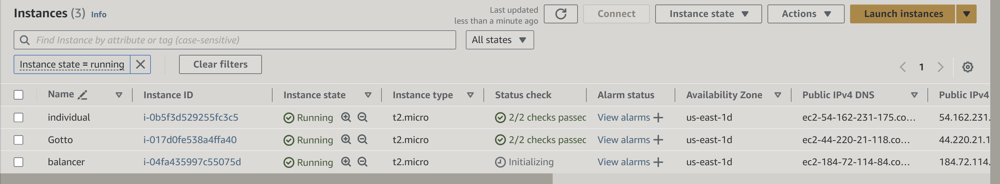


Attached Elastic Ip to both the two server leave the load balancer


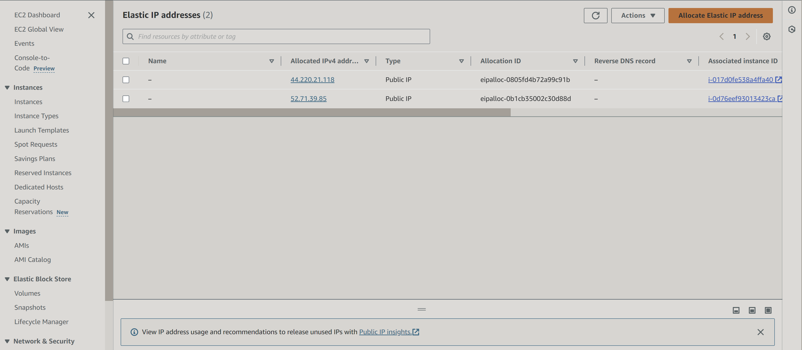

SSh into your Server


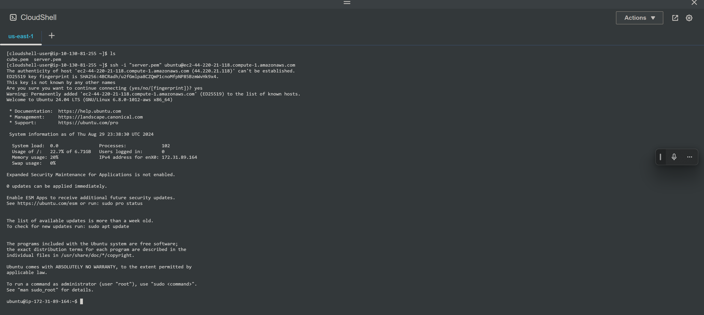


- To install Nginx, execute the following commands on your terminal.

`sudo apt update`

`sudo apt upgrade`

`sudo apt install nginx`

- Start your Nginx server by running the `sudo systemctl start nginx` command, enable it to start on boot by executing `sudo systemctl enable nginx`, and then confirm if it's running with the `sudo systemctl status nginx` command.
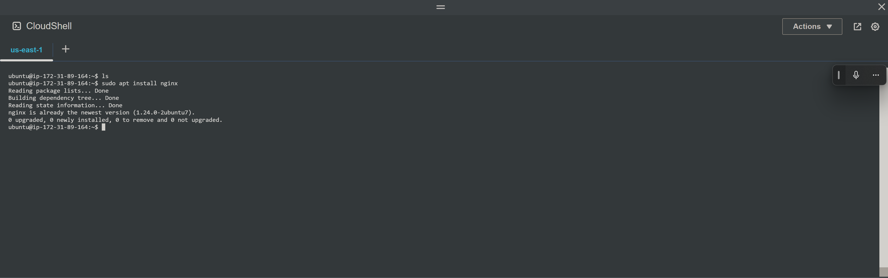
- Configure Nginx to serve static websites on each server. Visit your instances IP address in a web browser to view the default Nginx startup page.

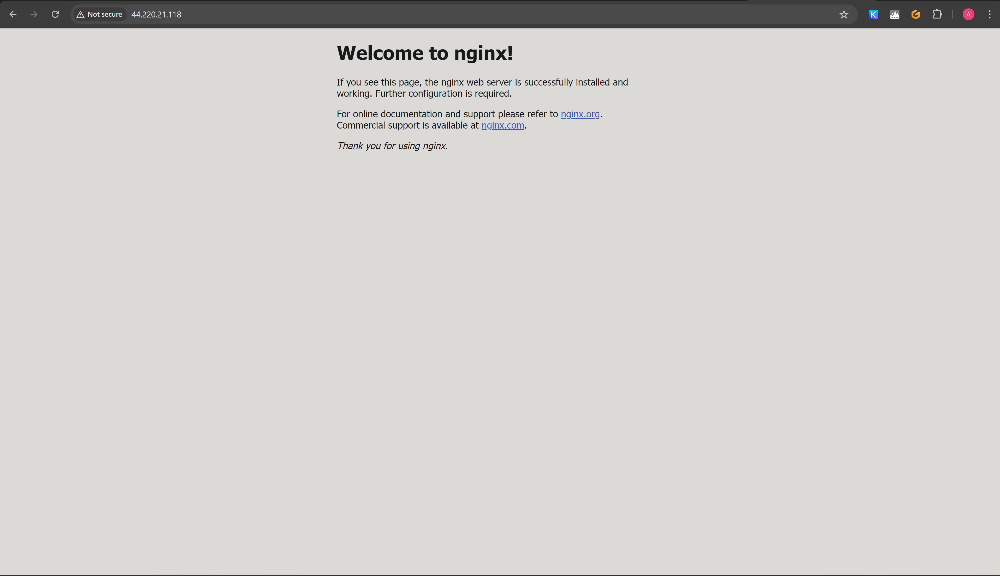

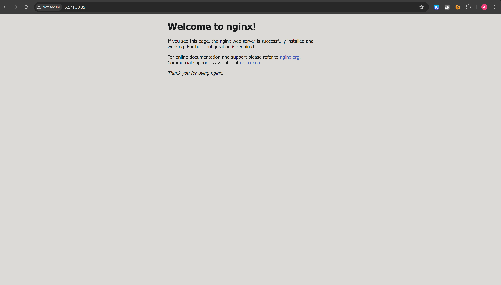

[!NOTE]
Install Nginx on both web server terminals. These are the terminals you're using to manage the servers hosting the two distinct website contents that the load balancer will distribute traffic to.


- Configure Nginx to act as a load balancer on the third server.


Install unzip to be able to unzip your website Template

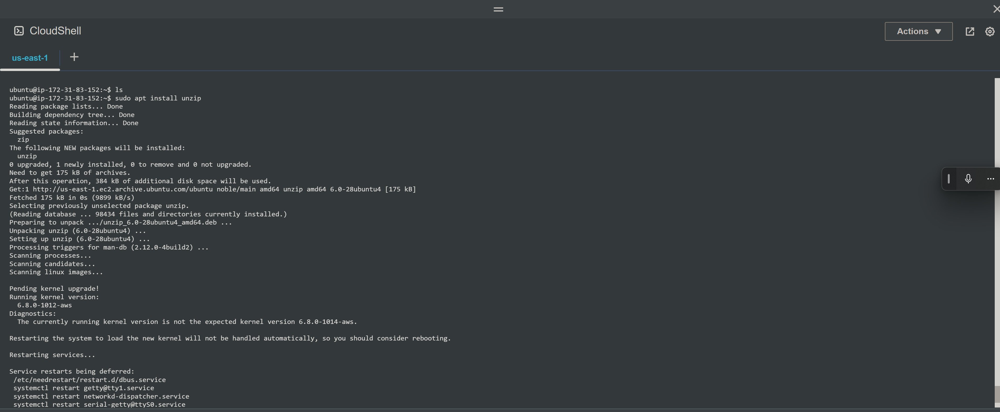

 Download your website template from your preferred website by navigating to the website, locating the template you want.
- Right click and select **Inspect** from the drop down menu.
- Click on the **Network** tab.
- Click the **Download** button and **right click on the website name**.
- Select **Copy** and click on **Copy URL**.
- Open your terminal and run the following command to download the template using `curl` command. 
Replace`http://example.com/template.zip` with the URL you copied earlier.

 unzip your website files `sudo curl -o /var/www/html/2096_individual.zip https://www.tooplate.com/zip-templates/2096_individual.zip && sudo unzip -d /var/www/html/ /var/www/html/2096_individual.zip && sudo rm -f /var/www/html/2096_individual.zip`.

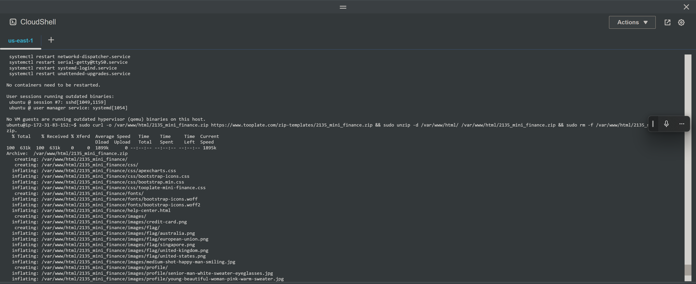


- To set up your website's configuration, start by creating a new file in the Nginx sites-available directory. Use the following command to open a blank file in a text editor: `sudo nano /etc/nginx/sites-available/individual`.

- Copy and paste the following code into the open text editor.

```
server {
    listen 80;
    server_name example.com www.example.com;

    root /var/www/html/example.com;
    index index.html;

    location / {
        try_files $uri $uri/ =404;
    }
}

```

- Edit the `root` directive within your server block to point to the directory where your downloaded website content is stored.

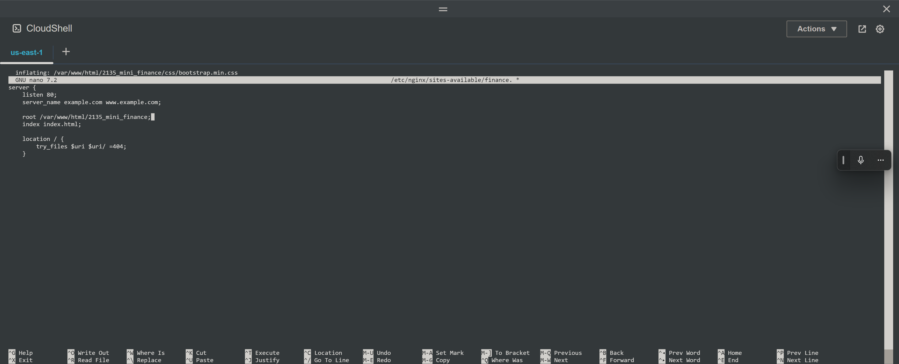

- Save and exit the text editor by pressing `Ctrl+X`, then `Y`.
- Create a symbolic link to the new configuration file in the sites-enabled directory: `sudo ln -

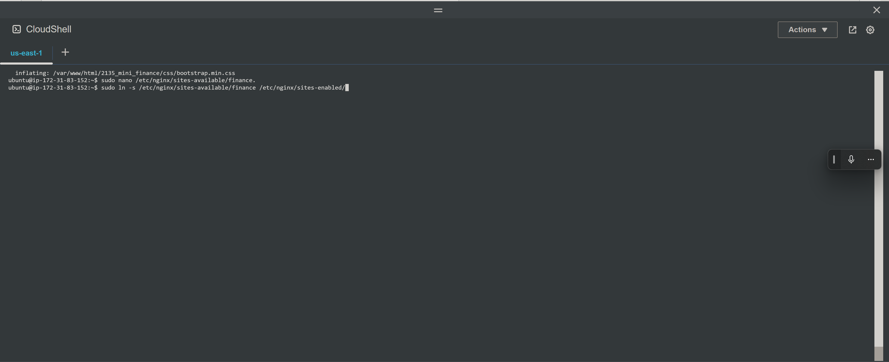

- Restart the Nginx service to apply the changes: `sudo service nginx restart`

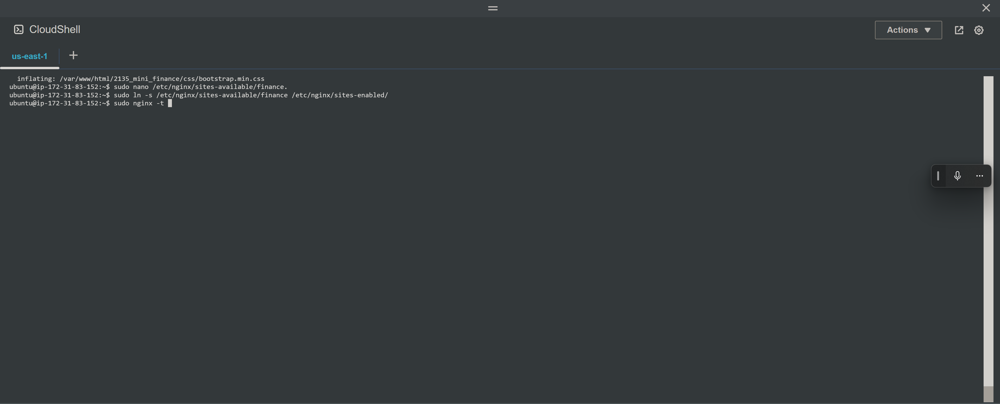

- Run the `sudo nginx -t` command to check the syntax of the Nginx configuration file, and when successful run the `sudo systemctl restart nginx` command.

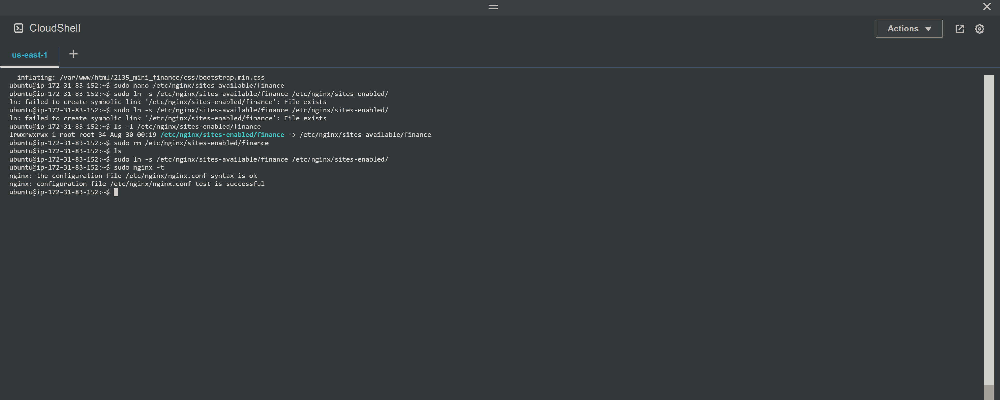

- Repeat the process for the second website.

> [!NOTE]
To better identify the impact of your changes, connect to the second server in a new terminal window. There, update the website content with something different. When you reload your website, the load balancer will distribute traffic, potentially sending you to the updated version on the second server. This will make the differences between the two versions clearer.

- Execute `sudo apt install unzip` to install the unzip tool and run the following command to download and unzip your website files `sudo curl -o /var/www/html/2134_gotto_job.zip https://www.tooplate.com/zip-templates/2134_gotto_job.zip && sudo unzip -d /var/www/html/ /var/www/html/2134_gotto_job.zip && sudo rm -f /var/www/html/2134_gotto_job.zip`.

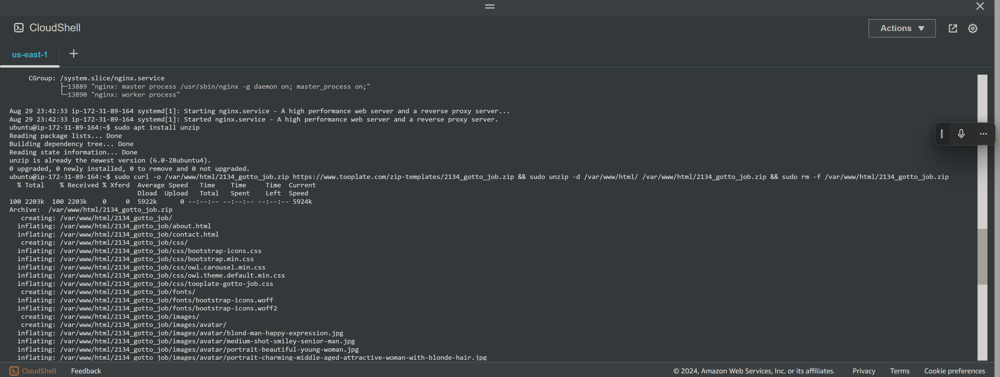

- To set up your website's configuration, start by creating a new file in the Nginx sites-available directory. Use the following command to open a blank file in a text editor: `sudo nano /etc/nginx/sites-available/gotto`.

- Copy and paste the following code into the open text editor.

```
server {
    listen 80;
    server_name placeholder.com www.placeholder.com;

    root /var/www/html/placeholder.com;
    index index.html;

    location / {
        try_files $uri $uri/ =404;
    }
}
```

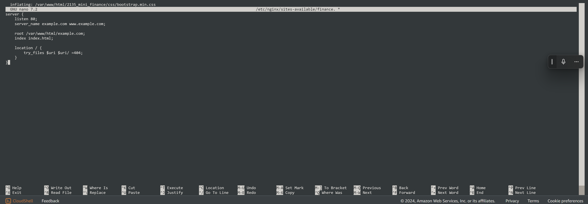

- Edit the `root` directive within your server block to point to the directory where your downloaded website content is stored.
- Save and exit the text editor by pressing `Ctrl+X`, then `Y`.

- Create a symbolic link for both websites by running the following command.

`sudo ln -s /etc/nginx/sites-available/gotto /etc/nginx/sites-enabled/`

- Run the `sudo nginx -t` command to check the syntax of the Nginx configuration file, and when successful run the `sudo systemctl restart nginx` command.


> [!NOTE]
On your first server, run `sudo rm /etc/nginx/sites-enabled/default`, and on your second server, run `sudo rm /etc/nginx/sites-enabled/default`. This will delete the default site-enabled folders and enable Nginx to serve content from your specified website directories. If you don't delete these default folders, you'll continue to see the default Nginx page.

- Run the `sudo systemctl restart nginx` command to restart your server.

- Check both IP addresses to confirm your website is up and running.

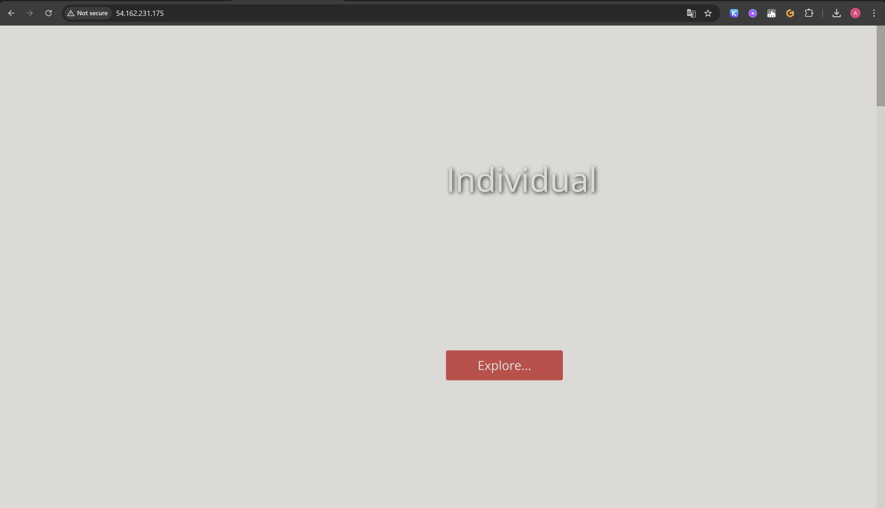


---

### Configure your Load balancer

- Install Nginx on the server you want to use as a load balancer, and execute `sudo systemctl status nginx` to ensure it's running.


- Execute `sudo nano /etc/nginx/nginx.conf` to edit your Nginx configuration file.


- Add the following within the http block.

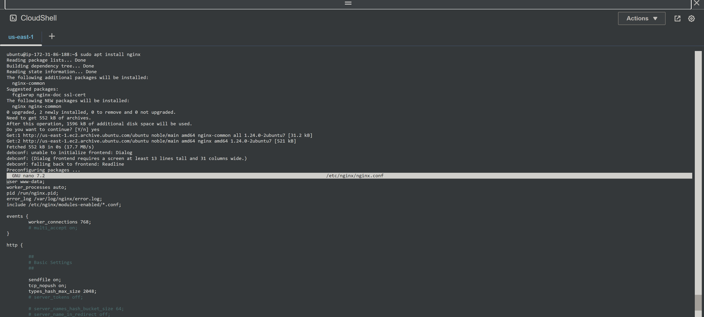

```

    upstream cloudghoul {
    server 1;
    server 2;
    # Add more servers as needed
}

server {
    listen 80;
    server_name <your domain> www.<your domain>;

    location / {
        proxy_pass http://cloudghoul;
    }
}

```

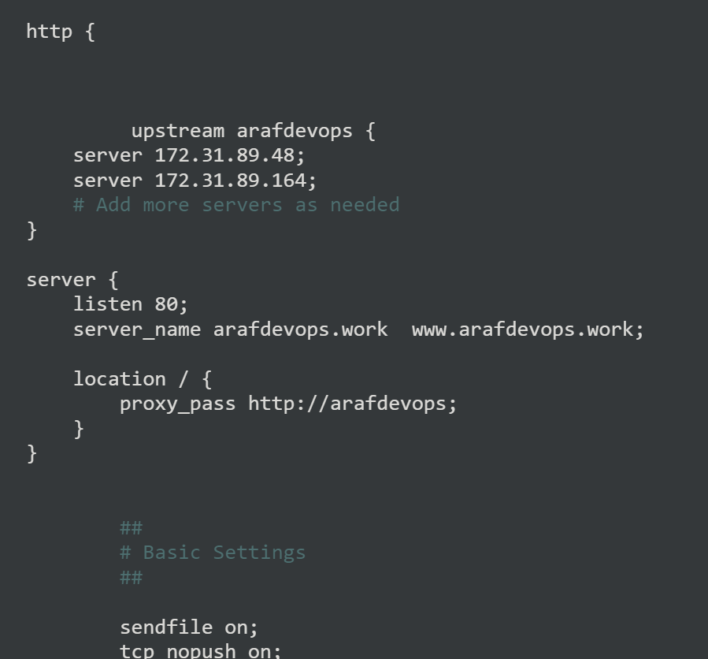

> [!NOTE]
Replace the necessary placeholders as shown in the picture above. Substitute `<server 1>` and `<server 2>` with the actual private IP addresses of your servers. Also, replace `<your domain> www.<your domain>` with your root domain and subdomain name, and update proxy_pass and the other relevant fields accordingly.

- Run `sudo nginx -t` to check for syntax error.


- Apply the changes by restarting Nginx:
`sudo systemctl restart nginx`

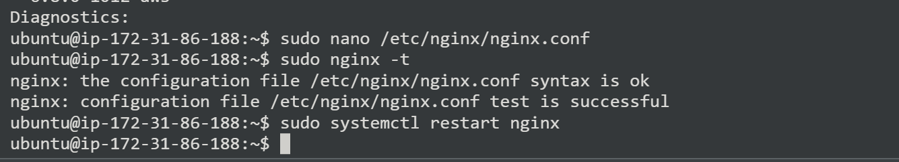
---

### Create An A Record

To make your website accessible via your domain name rather than the IP address, you'll need to set up a DNS record. I did this by buying my domain from Namecheap and then moving hosting to AWS Route 53, where I set up an A record.

> [!NOTE]
Visit [Project1](https://github.com/tearbu/first-project/blob/main/Documentation.md) for instructions on how to create a hosted zone.

- Point your domain's A records to the IP address of your Nginx load balancer server.

- In route 53, select the domain name and click on **Create record**.

- Paste your **IP address➀** and then click on **Create records➁** to create the root domain.


- Click on **create record** again, to create the record for your sub domain.

- Paste your IP address➀, input the Record name(**www➁**) and then click on **Create records**➂.

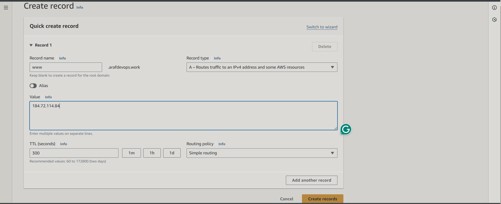

- Go to the terminal you used in setting your first website and run `sudo nano /etc/nginx/sites-available/individual` to edit your settings. Enter the name of your domain and then save your settings.
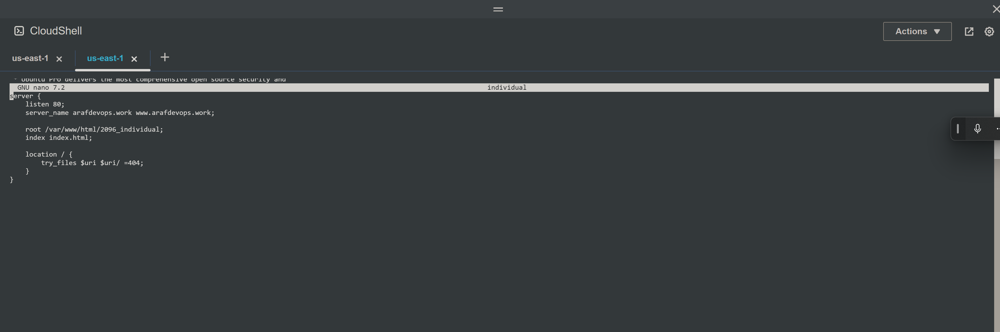

- Restart your nginx server by running the `sudo systemctl restart nginx` command.

- Go to the terminal you used in setting your second website and run `sudo nano /etc/nginx/sites-available/gotto` to edit your settings. Enter the name of your domain and then save your settings.


- Restart your nginx server by running the `sudo systemctl restart nginx` command.

- Go to your domain name in a web browser to verify that your website is accessible.

- Reload the webpage to ensure the load balancer distributes traffic evenly between your servers.
---

### Install certbot and Request For an SSL/TLS Certificate

- Install certbot by executing the following commands:
`sudo apt update`
`sudo apt install python3-certbot-nginx`

- Execute the `sudo certbot --nginx` command to request your certificate. Follow the instructions provided by certbot and select the domain name for which you would like to activate HTTPS.

- You should get a congratulatory message that says https has been successfully enabled.

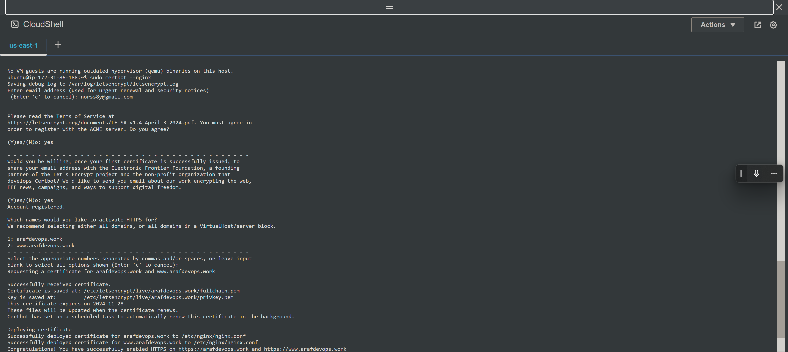

- Access your website to verify that Certbot has successfully enabled HTTPS.

- It is recommended to renew your LetsEncrypt certificate at least every 60 days or more frequently. You can test renewal command in dry-run mode:
`sudo certbot renew --dry-run`

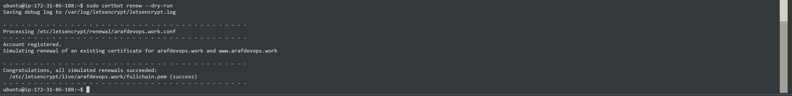

---
---

#### The End Of Project 3

